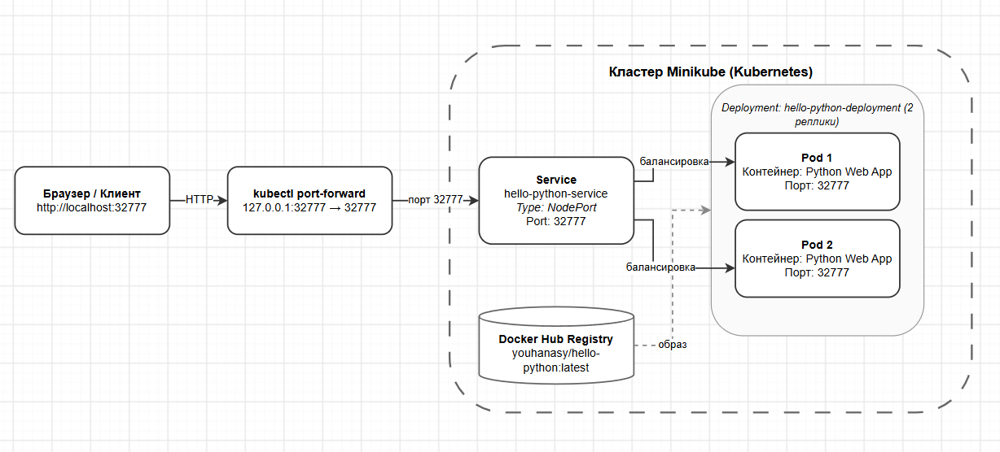
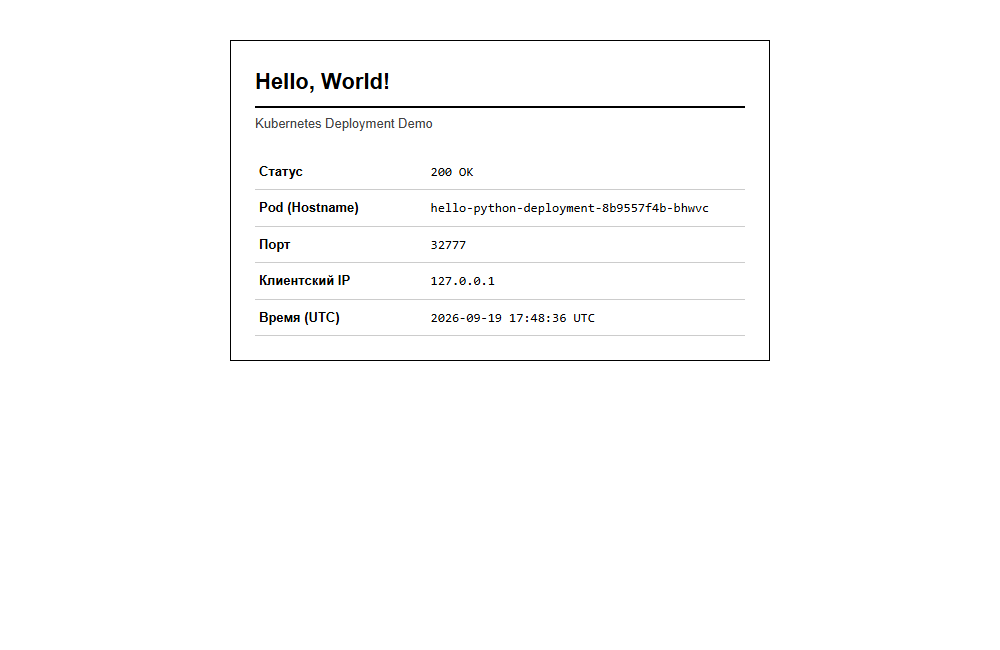
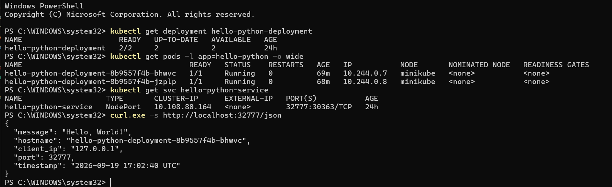
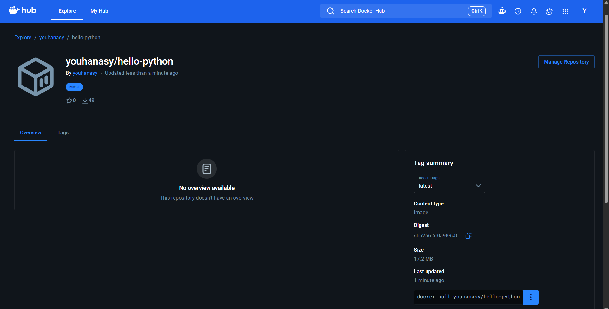

# Тестовое задание на стажировку

Решение тестового задания на позицию стажера (DevOps / Kubernetes).

## 1. Ответы на теоретические вопросы

Ответы на теоретические вопросы из первого раздела тестового задания находятся в отдельном текстовом файле:
[answers.txt](answers.txt)

---

## 2. Практическая часть

Веб-приложение "Hello World" на Python, работающее на порту 32777 и запущенное в кластере Kubernetes (2 реплики) с сервисом для доступа.

### Содержимое репозитория

- answers.txt — ответы на теоретические вопросы.
- app/ — исходный код веб-приложения на Python.
- Dockerfile — файл для сборки контейнера приложения.
- k8s/ — манифесты Kubernetes (deployment.yaml и service.yaml).
- screenshots/ — скриншоты результатов работы.

### Образ приложения

Образ собран и опубликован на Docker Hub:
youhanasy/hello-python:latest
Ссылка: https://hub.docker.com/r/youhanasy/hello-python

В манифесте k8s/deployment.yaml уже указан этот образ.

### Запуск и проверка

1. Применить манифесты в кластере Kubernetes:
```bash
kubectl apply -f k8s/
```

2. Проверить статус подов (должно быть 2 реплики в статусе Running):
```bash
kubectl get pods -l app=hello-python
```

3. Запустить проброс портов:
```bash
kubectl port-forward svc/hello-python-service 32777:32777
```

4. Открыть приложение в браузере:
http://localhost:32777

Также доступен JSON-эндпоинт:
```bash
curl http://localhost:32777/json
```

---

## 3. Скриншоты результатов работы

### 1. Схема организации контейнеров и сервисов (draw.io)


*Схема организации контейнеров и сервисов (draw.io)*

### 2. Работа веб-приложения в браузере


*Работа веб-приложения в браузере через порт 32777*

### 3. Статус ресурсов в кластере Kubernetes (Deployment, Pods, Service)


*Вывод команд kubectl get deployment, pods, svc и проверка эндпоинта*

### 4. Опубликованный образ на Docker Hub


*Страница репозитория youhanasy/hello-python на Docker Hub*
